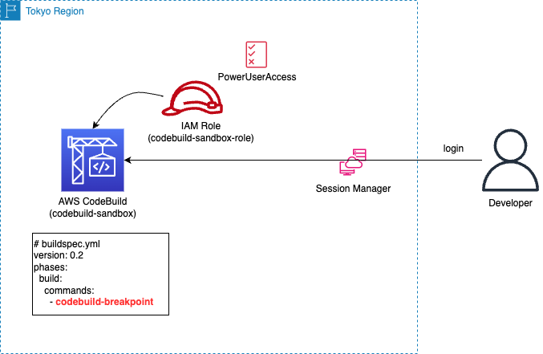
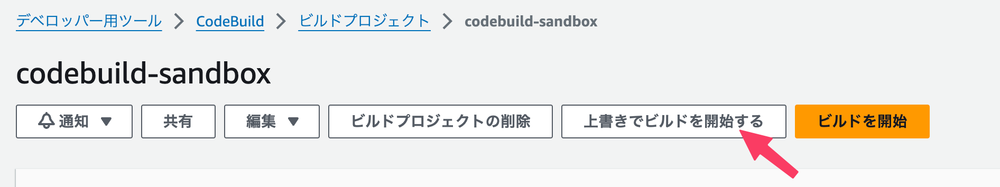
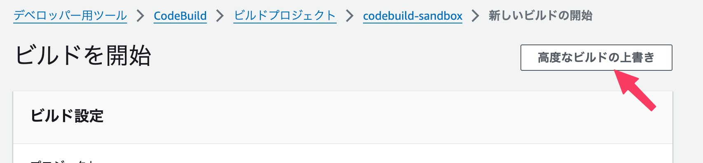
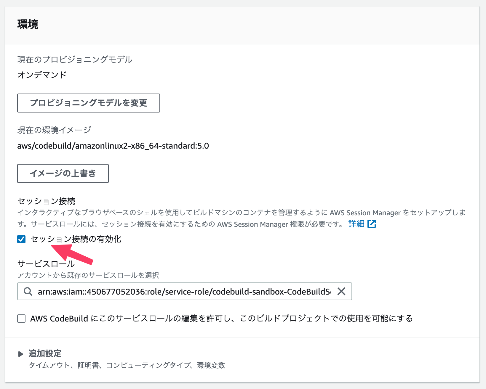
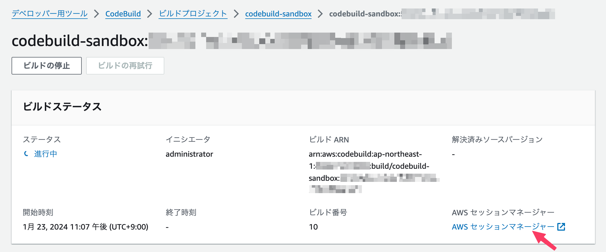

# codebuild-sandbox



buildspec.yml 作成のためのコマンド試行環境を用意する CloudFormation テンプレートです。

## スタック作成

以下クイックリンクから、東京リージョン向けのスタック作成が可能です。

[東京リージョンに作成](https://ap-northeast-1.console.aws.amazon.com/cloudformation/home?region=ap-northeast-1#/stacks/create/review?templateURL=https://t3yamoto.s3.ap-northeast-1.amazonaws.com/public/codebuild-sandbox/template.yml&stackName=codebuild-sandbox)

## 使用方法

マネジメントコンソール、または AWS CLI から使用可能です。

### マネジメントコンソール

構築した CodeBuild プロジェクト（デフォルトの名称は `codebuild-sandbox`）を開き、`上書きでビルドを開始する` をクリックします。



`高度なビルドの上書き` をクリックします。



`セッション接続の有効化` にチェックを入れ、`ビルドを開始` をクリックします。



ビルドが開始されます。20秒程度待ってリロードすると、`AWS セッションマネージャー` リンクが表示されるのでクリックします。



Session Manager にて起動中の CodeBuild 環境にログインされるので自由にコマンドの試行が可能です。なお、試行後は `codebuild-resume` コマンドでビルドを続行可能です。（試行中はブレイクポイントで中断している状況）

### AWS CLI

前提条件として、[AWS CLI 用の Session Manager プラグイン](https://docs.aws.amazon.com/ja_jp/systems-manager/latest/userguide/session-manager-working-with-install-plugin.html)を予めインストールしておく必要があります。

以下コマンドでセッション接続を有効化にしたビルドを開始します。Session Manager のターゲット ID が標準出力されます。

```sh
$ aws --no-cli-pager codebuild start-build --project-name codebuild-sandbox --debug-session-enabled --query 'build.id' --output text | cut -d':' -f2 | awk '{print "codebuild:"$1}'
codebuild:231980c8-a8a7-4118-80c2-83c1242cd2e0
```

20秒ほど待って、以下コマンドで Session Manager 経由で実行中の CodeBuild 環境にログインします。

```sh
$ aws ssm start-session --target <ターゲット ID>
```

なお、AWS CLI から実行する場合、 `codebuild-resume` を実行すると追加の操作が行えないため、終了する際は `exit` するようにします。実行中のビルドは別途停止しておきましょう。

## 参考

- [セッションマネージャーで実行中のビルドを表示する - AWS CodeBuild](https://docs.aws.amazon.com/ja_jp/codebuild/latest/userguide/session-manager.html)
